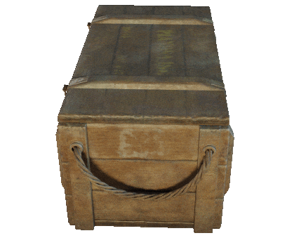

Batch Render
========================================

.. raw:: html

    <iframe width="560" height="315" src="https://www.youtube.com/embed/a2vhU846f98" frameborder="0" allow="accelerometer; autoplay; clipboard-write; encrypted-media; gyroscope; picture-in-picture" allowfullscreen></iframe>

**Batch Render** is a *command line tool* that makes use of **Blender** to quickly render multiple objects from multiple angles.

**Features:**

* **Recursive rendering**, renders all objects from current folder and it's subfolders.
* Support for **.obj** and **.fbx**
* Automatic material creation and assignment

   * **Albedo** support
   * **Opacity** support
   * **Emissive** support
   * **Metallic** support
   * **Roughness** support
   * **Normal Map** support
   * **Height** support

* Automatically **fits the camera to the object**
* Easy **selection and creation of rendering presets**
* Easy **turntable generation** with custom amount of frames
* Render engine defined by render preset (supports **Eevee**, **Cycles** and **Workbench**)

|

*Example of turntable rendered with Batch Render*

.. toctree::
   :maxdepth: 1
   :caption: Contents:

   installation
   usage
   batchRename
   contact
